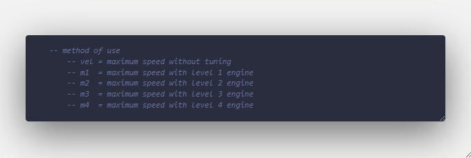
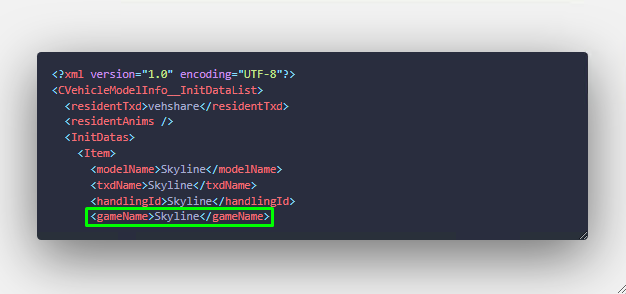
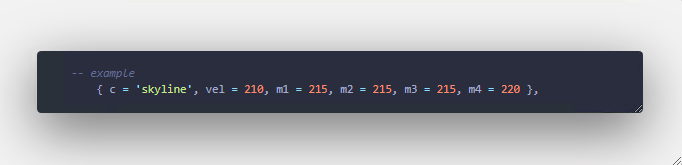

# zabittat_handling

The usage method is simple; place the package in the desired folder on the server and start it.
Subsequent to this you must understand what!

#### c = gameName in the vehicles.meta file of the handling of the vehicle in question

#### vel = maximum speed without any modification to the vehicle's engine.
#### m1 = maximum speed with level 1 engine modification; and so on

